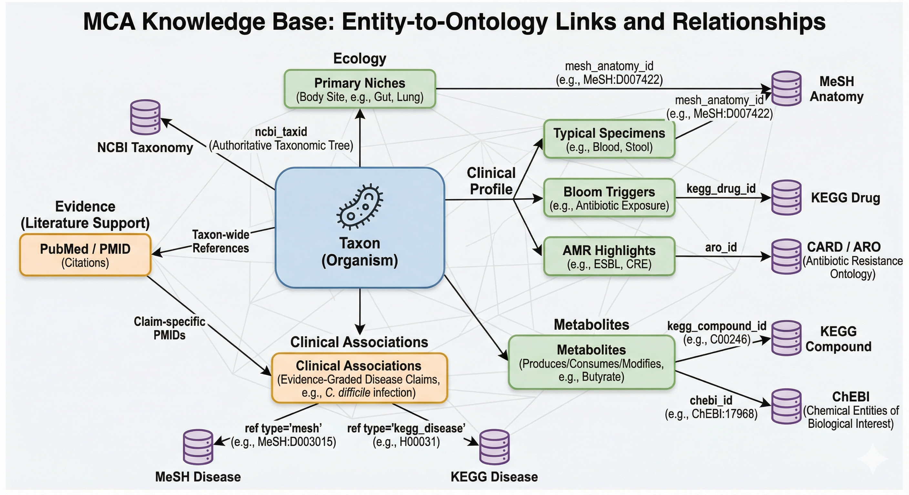
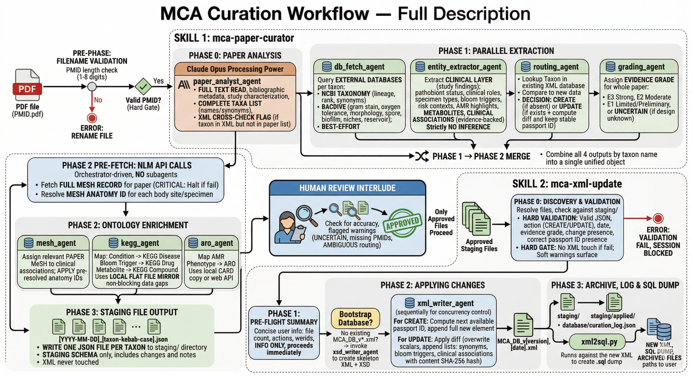

# Microbial Clinical Atlas (MCA)
> A curated clinical knowledge base turning microbiome research into actionable insights for human health

 

**Web app**: [https://mca.thebiohub.ca](https://mca.thebiohub.ca) — full Taxon Passport browser with Advanced Search (pathway / taxon / disease)<br />
**Public API**: [https://mca.thebiohub.ca/api/v1/meta](https://mca.thebiohub.ca/api/v1/meta) — read-only JSON endpoints (see [API](#public-api))<br />
**iOS app**: [https://apps.apple.com/app/microbial-clinical-atlas/](https://apps.apple.com/app/microbial-clinical-atlas/id6761735200)

## Introduction

**Microbial Clinical Atlas (MCA)** is a curated knowledge base for translating microbiome readouts into clinically and biologically interpretable insights. MCA organizes microbial information into standardized **Taxon Passports** — structured records capturing taxonomic identity, ecological context, clinical associations, and evidence-linked references (PMIDs). The current release (v1.10) holds **64 taxon passports** drawn from **25 curated papers**, with **139 evidence-graded clinical associations**. The project is designed to support microbiologists, bioinformaticians, and translational researchers by providing consistent fields, stable identifiers, and structured, reproducible outputs.

---

## Rationale

Microbiome studies routinely report associations between taxa and clinical or experimental phenotypes, but interpretation is often limited by inconsistent terminology, heterogeneous reporting standards, and fragmented evidence across publications. MCA addresses this gap by (i) standardizing how taxa are described, (ii) attaching explicit evidence (PMIDs) to every clinical claim, and (iii) enabling systematic comparison across taxa and contexts. MCA is intended to function as a reusable reference layer for interpreting sequencing-based microbiome profiles and for generating mechanism-informed hypotheses in translational microbiome research.

---

## Aims

- **Standardize** curated microbial knowledge into consistent, comparable Taxon Passports with stable identifiers.
- **Link evidence** to curated claims using explicit literature references (PMIDs) and structured evidence grades.
- **Validate** AI-curated content with a structured **Expert Review System** before each release (see [Expert Review System](#expert-review-system)).
- **Support interpretation** of microbiome signals in clinical and translational settings by organizing taxa, contexts, and evidence in a reusable framework.
- **Enable reuse** via versioned, structured exports (XML, SQL, JSON) suitable for web applications, downstream analysis, and the iOS companion app.

---

## Data model

Each taxon in MCA has exactly one **Taxon Passport** — the central structured record. Passports are organized into four feature groups:

| Group | What it captures |
|-------|-----------------|
| **Identity** | Taxonomic name, rank, domain, NCBI TaxID, lineage, synonyms, stable `passport_id` |
| **Biology** | Gram status, oxygen tolerance, morphology, key traits (e.g., spore-forming, biofilm-producing) |
| **Ecology** | Primary body-site niches, reservoirs (human/animal/environment), transmission routes |
| **Clinical profile** | Pathobiont status, clinical roles, typical specimen types, bloom triggers, risk contexts, AMR highlights, metabolites |

Each passport also carries **Clinical Associations** — individual evidence-graded claims linking the taxon to a specific condition or outcome, each backed by one or more PMIDs.



### Evidence grades

| Grade | Meaning |
|-------|---------|
| **E3** | Strong clinical evidence — clinical practice guidelines, systematic reviews, pooled meta-analyses (across RCTs or cohorts), or a discovery + independent validation cohort design within a single paper |
| **E2** | Moderate evidence — a single human cohort (including multi-center observational cohorts without pooled analysis), a single RCT, case-control, or cross-sectional study |
| **E1** | Limited / preliminary — animal models, in vitro studies, case reports, mechanistic work |

`UNCERTAIN` claims are stored in the canonical XML for audit but excluded from the SQL dump and the public API — they are not surfaced to clinicians.

### Stable identifiers

Passport IDs follow the format `MCA-[DOMAIN]-[NNNNNN]` (e.g., `MCA-BAC-000001` for bacteria, `MCA-FUN-000001` for fungi). These identifiers are permanent and are never reassigned.

### Versioning

MCA uses a two-part version scheme `vMAJOR.MINOR`. **Release** versions always end in digit `0` (v1.10, v1.20, …) and ship as tagged GitHub Releases with attached XML + SQL artifacts. **Dev** versions never end in `0` and cover intermediate curation cycles between releases.

---

## Curation pipeline

MCA entries are produced by a two-skill, human-in-the-loop curation pipeline that combines AI-assisted extraction with structured expert review.



### Skill 1 — mca-paper-curator

Reads one or more research papers (PDFs; each filename must be its PMID, e.g. `38123456.pdf`) and writes one staging JSON file per identified taxon. Multiple PDFs run as fully independent parallel pipelines. The pipeline runs in five phases using a 12-agent team:

- **Phase 0** — A paper analyst agent reads the full PDF, identifies all taxa, and extracts study metadata (title, design, population, sample size).
- **Phase 1** — Four agents run in parallel: a database fetch agent pulls biology and ecology fields from NCBI Taxonomy and BacDive by TaxID; a clinical extractor agent pulls the clinical layer (pathobiont status, roles, bloom triggers, AMR, metabolites, associations) directly from the paper text; a routing agent checks whether each taxon is a CREATE or UPDATE against the existing XML; and a grading agent assigns a single E1/E2/E3 evidence grade to the paper.
- **Phase 2** — Four ontology enrichment agents run in parallel: a MeSH agent assigns NLM MeSH terms and anatomy IDs; a KEGG agent maps conditions, drugs, and metabolites to KEGG Disease, Drug, and Compound IDs; an ARO agent maps resistance phenotypes to CARD ARO identifiers; and a VFDB agent maps virulence factor names to VFDB identifiers.
- **Phase 3** — A null-review agent re-attempts all unresolved ontology IDs using local indexes and web fallbacks, classifying each null as confirmed, filled, or needs-review. One staging JSON file per taxon is then written to `staging/`. The XML database is never modified here.
- **Phase 4** — A sanity-check agent validates all fields for format, controlled-vocabulary compliance, and logical consistency; a QC report agent aggregates null-field root causes and writes a human-readable Markdown QC report alongside the staging JSON.

### Skill 2 — mca-xml-update

Takes one or more approved staging JSON files and applies them to the XML knowledge base:

- **Phase 0** — Each file is hard-validated (JSON integrity, required fields, CREATE/UPDATE consistency against the XML). Any hard failure blocks all writes.
- **Phase 1** — A non-blocking pre-flight summary is shown: files to apply, CREATE vs UPDATE counts, fields to be changed, and any warnings (UNCERTAIN grades, missing PMIDs).
- **Phase 2** — One `xml_writer_agent` is spawned per file, sequentially. CREATE actions assign a new passport ID; UPDATE actions only append to list fields and overwrite scalar fields — existing data is never removed. A SHA-256 content hash is computed for each clinical association on write.
- **Phase 3** — Applied staging files are archived to `staging/applied/`, a curation log entry is appended to `database/curation_log.json`, and `xml2sql.py` is run to regenerate the SQL dump and the public-API JSON files.

---

## Expert Review System

Every release of MCA passes through a structured **Expert Review** cycle in which a small panel of domain experts validates the AI-curated clinical claims before they reach end users. The system is the trust-conferring step between the AI pipeline and the public knowledge base — the moment where each MCA claim earns its citability.

### Why a review system exists

The AI curation pipeline is fast and consistent, but it cannot judge clinical nuance the way a domain expert can. Without human validation, an AI-curated knowledge base risks propagating overstated claims, mis-graded evidence, or subtle wording errors at scale. MCA's review system makes that human-judgment check explicit, structured, and reproducible.

### Reviewer experience

- Each reviewer receives a **unique opaque token URL** (`/review.php?t=<64-hex>`) — no login, no account, fully anonymous.
- The landing page lists the reviewer's assigned papers; a per-paper page shows each clinical association as a card with two voting rows:
  - **Evidence level** — accept the curator's grade or pick a different one (E3 / E2 / E1 / Undetermined).
  - **Quality of statement** — Accurate / Overstated / Understated / Unsure.
- Optional comment per claim and per paper. Votes auto-save on every click.
- A built-in yellow **reviewer guidelines** callout on every paper page explains the four evidence levels and four quality grades.
- A standalone visual walkthrough is hosted at <https://mca.thebiohub.ca/reviewer_howto.html>.

---

## Public API

MCA exposes a read-only JSON API for programmatic access. Endpoints are static files served directly by nginx — no authentication, no rate limit (within reason), 1-hour browser/proxy cache, full CORS.

| Endpoint | Returns |
|---|---|
| `GET /api/v1/meta` | DB version, last-update date, passport + association counts |
| `GET /api/v1/passports/{passport_id}` | Full nested passport (biology, ecology, clinical profile, metabolites, evidence PMIDs, associations with refs and PMIDs) |

```bash
curl https://mca.thebiohub.ca/api/v1/meta
curl https://mca.thebiohub.ca/api/v1/passports/MCA-BAC-000001
```

Each passport JSON is regenerated alongside the SQL dump on every release (see `database/xml2sql.py`). Unknown IDs return a JSON 404 with a hint pointing at `/api/v1/meta`.

---

## iOS App

An iPhone companion app for MCA is available on the App Store. Built with SwiftUI (iOS 17+). Uses Apple frameworks plus a small set of Swift packages for on-device AI (`mlx-swift`, `Gemma4Swift`, `swift-transformers`).

### Passports
Offline SQLite browser of all curated taxon passports. Full-text search, bookmarks, and a full passport detail view that mirrors the web layout.

### Advanced Search
Unified search bar over KEGG pathways, MCA taxa, and diseases — a slimmer mobile counterpart of the web Advanced Search. Selecting a suggestion auto-routes to the right view (pathway → linked taxa, taxon → linked pathways + co-occurring taxa + drug target classes, disease → linked taxa + pathways).

### Extractor (optional, on-device AI)
Opt-in tool for suggesting papers to the curation team. Enter a PMID, the app fetches the abstract from PubMed, and a small on-device language model (Gemma 4 E2B INT4 via `mlx-swift`) scans it for candidate microbial taxa. The user reviews the result and emails a quick reference to the curation inbox. Nothing leaves the device unless the user taps Send in Mail. Requires iPhone 15 Pro or newer; the ~3.6 GB model downloads on first opt-in.

### About
Database stats, curation pipeline overview, acknowledgements.

---

## Tech stack

### Web
- **Backend:** PHP 8.3 with PDO (MySQL)
- **Database:** MySQL 8.4 (InnoDB, utf8mb4), 10-table canonical schema; separate 5-table `MCA_review` schema for review cycles
- **Frontend:** Vanilla HTML/CSS/JS — no frameworks; Google Fonts (Montserrat, Roboto)
- **Server:** Rocky 9 + nginx 1.20 + PHP-FPM, Let's Encrypt TLS
- **Local dev:** Docker stack mirroring production (`docker/docker-compose.yml`)
- **Export:** Versioned XML in `database/`; SQL dump (`.sql.gz`) and public-API JSON files (`web/api/v1/`) regenerated from XML via `database/xml2sql.py` on every release

### iOS
- **Language:** Swift (SwiftUI, iOS 17+)
- **Database:** SQLite (generated from XML via `database/xml2sqlite.py`)
- **On-device AI:** Gemma 4 E2B INT4 via `mlx-swift` / `Gemma4Swift` / `swift-transformers` (for the optional Extractor)

---

**Maintained by:** [Bioinformatics Hub](https://TheBioHub.ca/), Snyder Institute, Cumming School of Medicine, University of Calgary<br />
**Contact at:** Bioinformatics@ucalgary.ca
