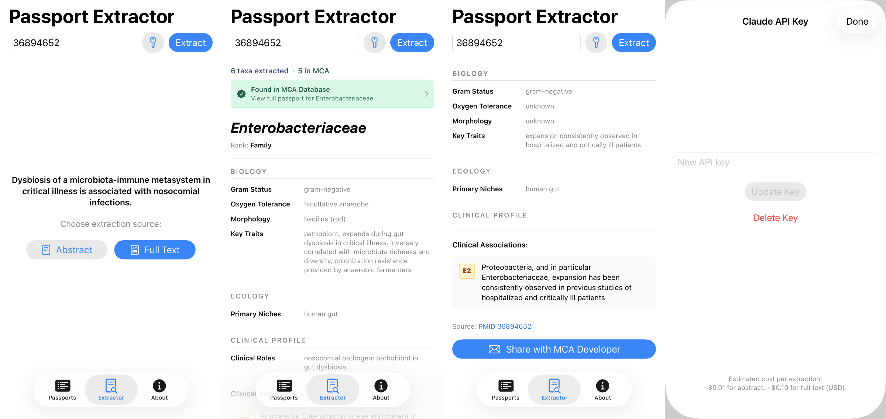

# Microbial Clinical Atlas (MCA)
> A curated clinical knowledge base turning microbiome research into actionable insights for human health

 

**Maintained by:** [Bioinformatics Hub](https://TheBioHub.ca/), Snyder Institute, Cumming School of Medicine, University of Calgary
**Contact at:** Bioinformatics@ucalgary.ca

## Introduction

**Microbial Clinical Atlas (MCA)** is a curated knowledge base for translating microbiome readouts into clinically and biologically interpretable insights. MCA organizes microbial information into standardized **Taxon Passports** — structured records capturing taxonomic identity, ecological context, clinical associations, and evidence-linked references (PMIDs). The project is designed to support microbiologists, bioinformaticians, and translational researchers by providing consistent fields, stable identifiers, and structured, reproducible outputs.

---

## Rationale

Microbiome studies routinely report associations between taxa and clinical or experimental phenotypes, but interpretation is often limited by inconsistent terminology, heterogeneous reporting standards, and fragmented evidence across publications. MCA addresses this gap by (i) standardizing how taxa are described, (ii) attaching explicit evidence (PMIDs) to every clinical claim, and (iii) enabling systematic comparison across taxa and contexts. MCA is intended to function as a reusable reference layer for interpreting sequencing-based microbiome profiles and for generating mechanism-informed hypotheses in translational microbiome research.

---

## Aims

- **Standardize** curated microbial knowledge into consistent, comparable Taxon Passports with stable identifiers.
- **Link evidence** to curated claims using explicit literature references (PMIDs) and structured evidence grades.
- **Support interpretation** of microbiome signals in clinical and translational settings by organizing taxa, contexts, and evidence in a reusable framework.
- **Enable reuse** via versioned, structured exports (XML and SQL) suitable for web applications and downstream analysis.

---

## Data model

Each taxon in MCA has exactly one **Taxon Passport** — the central structured record. Passports are organized into four feature groups:

| Group | What it captures |
|-------|-----------------|
| **Identity** | Taxonomic name, rank, domain, NCBI TaxID, lineage, synonyms, stable `passport_id` |
| **Biology** | Gram status, oxygen tolerance, morphology, key traits (e.g., spore-forming, biofilm-producing) |
| **Ecology** | Primary body-site niches, reservoirs (human/animal/environment), transmission routes |
| **Clinical profile** | Pathobiont status, clinical roles, typical specimen types, bloom triggers, risk contexts, AMR highlights, metabolites |

Each passport also carries **Clinical Associations** — individual evidence-graded claims linking the taxon to a specific condition or outcome, each backed by one or more PMIDs.

### Evidence grades

| Grade | Meaning |
|-------|---------|
| **E3** | Strong clinical evidence — guidelines, meta-analyses, systematic reviews, or multiple independent human cohorts |
| **E2** | Moderate evidence — single cohort, single RCT, case-control, or cross-sectional study |
| **E1** | Limited / preliminary — animal models, in vitro studies, case reports, mechanistic work |

### Stable identifiers

Passport IDs follow the format `MCA-[DOMAIN]-[NNNNNN]` (e.g., `MCA-BAC-000001` for bacteria, `MCA-FUN-000001` for fungi). These identifiers are permanent and are never reassigned.

---

## Curation pipeline

MCA entries are produced by a two-skill, human-in-the-loop curation pipeline:

### Skill 1 — mca-paper-curator

Reads one or more research papers (PDFs; each filename must be its PMID, e.g. `38123456.pdf`) and writes one staging JSON file per identified taxon. Multiple PDFs run as fully independent parallel pipelines. The pipeline runs in five phases using a 12-agent team:

- **Phase 0** — A paper analyst agent reads the full PDF, identifies all taxa, and extracts study metadata (title, design, population, sample size).
- **Phase 1** — Four agents run in parallel: a database fetch agent pulls biology and ecology fields from NCBI Taxonomy and BacDive by TaxID; a clinical extractor agent pulls the clinical layer (pathobiont status, roles, bloom triggers, AMR, metabolites, associations) directly from the paper text; a routing agent checks whether each taxon is a CREATE or UPDATE against the existing XML; and a grading agent assigns a single E1/E2/E3 evidence grade to the paper.
- **Phase 2** — Four ontology enrichment agents run in parallel: a MeSH agent assigns NLM MeSH terms and anatomy IDs; a KEGG agent maps conditions, drugs, and metabolites to KEGG Disease, Drug, and Compound IDs; an ARO agent maps resistance phenotypes to CARD ARO identifiers; and a VFDB agent maps virulence factor names to VFDB identifiers.
- **Phase 3** — A null-review agent re-attempts all unresolved ontology IDs using local indexes and web fallbacks, classifying each null as confirmed, filled, or needs-review. One staging JSON file per taxon is then written to `staging/`. The XML database is never modified here.
- **Phase 4** — A sanity-check agent validates all fields for format, controlled-vocabulary compliance, and logical consistency; a QC report agent aggregates null-field root causes and writes a human-readable Markdown QC report alongside the staging JSON.

### Skill 2 — mca-xml-update

Takes one or more approved staging JSON files and applies them to the XML knowledge base:

- **Phase 0** — Each file is hard-validated (JSON integrity, required fields, CREATE/UPDATE consistency against the XML). Any hard failure blocks all writes.
- **Phase 1** — A non-blocking pre-flight summary is shown: files to apply, CREATE vs UPDATE counts, fields to be changed, and any warnings (UNCERTAIN grades, missing PMIDs).
- **Phase 2** — One `xml_writer_agent` is spawned per file, sequentially. CREATE actions assign a new passport ID; UPDATE actions only append to list fields and overwrite scalar fields — existing data is never removed. A SHA-256 content hash is computed for each clinical association on write.
- **Phase 3** — Applied staging files are archived to `staging/applied/`, a curation log entry is appended to `database/curation_log.json`, and `xml2sql.py` is run to regenerate the SQL dump.

---

## iOS App

An iPhone companion app for MCA is available on the App Store. Built with SwiftUI (iOS 17+) using only Apple frameworks — no external dependencies.

### Passports
Offline SQLite browser of all curated taxon passports. Full-text search, bookmarks, and a full passport detail view that mirrors the web layout.

### Extractor
Enter a PMID, choose abstract or full text, and the app fetches the paper from PubMed/PMC (or accepts a PDF upload), sends it to the Claude API, extracts all taxa, and cross-references results against the MCA database. Results are cached locally. Once extracted, users can share the result as a JSON file with the developer so that **community contributions can be reviewed and incorporated into future MCA releases**.

### About
Database stats, curation pipeline overview, acknowledgements.

## Note on App Store availability
Apple rejected the **Passport Extractor feature** because it uses a user-provided API key to access Claude — which Apple treats as a paid transaction that must go through their in-app purchase system, while Siri has limited capacity. The app is free, open-source, and no payment is involved — users simply bring their own API key. Apple does not offer an exception for academic or research tools. The App Store version ships without the Extractor (Passports + About only). The full app with the Extractor is available by building from source in the iOS folder.

---

## Tech stack

### Web
- **Backend:** PHP 7.4+ with PDO (MySQL)
- **Database:** MySQL (InnoDB, UTF-8), 10-table schema centered on `passport`
- **Frontend:** Vanilla HTML/CSS/JS; Google Fonts (Montserrat, Roboto)
- **Deployment:** LAMP stack
- **Export:** Versioned XML dumps in `database/`; SQL dumps generated from XML via `xml2sql.py`

### iOS
- **Language:** Swift (SwiftUI, iOS 17+)
- **Database:** SQLite (generated from XML via `xml2sqlite.py`)
- **Dependencies:** None — Apple frameworks only
